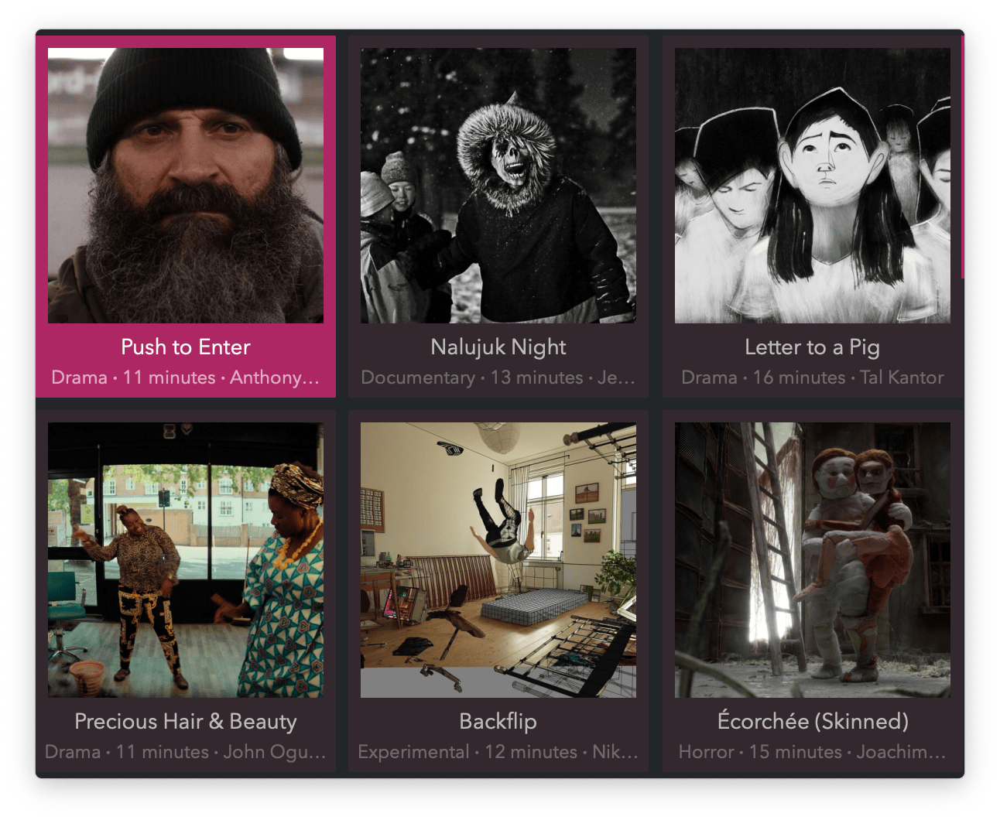

#  Short Films Alfred Workflow

Stream from a selection of short films

[⤓ Install on the Alfred Gallery](https://alfred.app/workflows/vitor/short-films)

## Usage

Watch recent short films from [Short of the Week](https://www.shortoftheweek.com/) via the `shorts` keyword.

* <kbd>↩</kbd> Stream short.
* <kbd>⌥</kbd> See synopsis.
* <kbd>⌘</kbd><kbd>↩</kbd> Download. Requires [Download Media](https://alfred.app/workflows/vitor/download-media/).
* <kbd>⌃</kbd><kbd>↩</kbd> Copy link to clipboard.

Different Grid Styles can be set in the [Workflow’s Configuration](https://www.alfredapp.com/help/workflows/user-configuration/).

Video streams to [mpv](https://mpv.io/), [IINA](https://lhc70000.github.io/iina/), or [VLC](https://www.videolan.org/vlc/) if any is installed, otherwise it falls back to the web browser.
